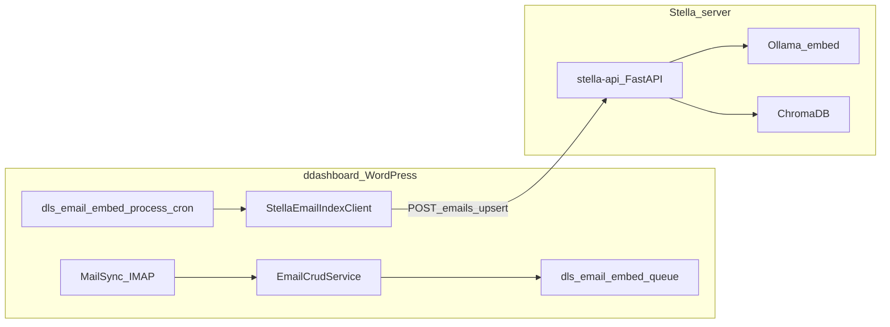

# ddashboard and Stella server — how they fit together

This document describes the **roles**, **network paths**, **data flows**, and **operational boundaries** between the **ddashboard** WordPress theme (Hetzner managed hosting) and the **Stella** stack (Hetzner dedicated server: FastAPI, Ollama, ChromaDB, Caddy, optional **IMAP mailbox copy** service).

**Related docs**

- Server topology and ports: [`../stella-server/infrastructure.md`](../stella-server/infrastructure.md)
- Stella HTTP API (FastAPI): [`../stella-server/stella-api.md`](../stella-server/stella-api.md)
- Stella **imapsync** helper (Express on `:3001`): [`../stella-server/imap-sync-service.md`](../stella-server/imap-sync-service.md)
- Email embed queue end-to-end: [`email-indexing.md`](email-indexing.md)
- WordPress theme architecture (long): [`../stella-dashboard/architecture.md`](../stella-dashboard/architecture.md)

---

## 1. Roles

| System | Role |
|--------|------|
| **ddashboard** | Custom WordPress theme: CRM, accounting, IMAP mail storage in MySQL (`dls_*` tables), REST API `dls/v1`, React SPA, Anthropic-based AI chat and Ollama-based email analyses (jobs started from WP). **Source of truth** for email rows, clients, transactions, and configuration stored in WP options. |
| **Stella** | Dedicated AI / services host: **Ollama** (LLM + embeddings), **ChromaDB** (vector store v2 API), **stella-api** (FastAPI) exposing `/emails/upsert`, `/emails/query`, etc., **Caddy** reverse proxy on `:8080`. Optional **`imap-sync`** service: Express + **`imapsync`** CLI to copy mail between two IMAP accounts (migration tool — **not** ddashboard’s import into `dls_email`). |

Neither system replaces the other: WordPress owns relational data and user sessions; Stella owns **vector search** and can run **heavy models** close to Ollama/Chroma.

---

## 2. Network and trust model

- **Browser** talks only to **WordPress** (HTTPS). The browser **never** calls Stella directly for product features.
- **WordPress (ddashboard)** makes **server-to-server** HTTP(S) requests to Stella when features require it, for example:
  - **Email indexing:** `StellaEmailIndexClient` → `POST {base}/emails/upsert`
  - **Tests / health:** routes under `inc/routes/stella-api-test.php` (if configured)
- **Base URL and auth** for the index API are WordPress options (see `OptionService` / Verwaltung → AI-Anbindungen pattern):
  - `dls_stella_email_index_url` — **full HTTP root of stella-api** from WordPress’s perspective, including any path prefix (trailing slash stripped in `StellaEmailIndexClient`). Example when Caddy serves the API under `/stella` on port 8080: `http://<stella-host>:8080/stella` → WordPress calls `…/stella/emails/upsert` and `…/stella/emails/document/email_24128` (same URL you would use with `curl …/stella/emails/document/email_24128`).
  - `dls_stella_email_index_key` — optional; sent as **`X-Stella-Key`** when non-empty
  - `dls_email_embed_enabled`, `dls_email_embed_batch_size` — queue behaviour

Stella should be reachable from the **managed WordPress host’s outbound IP** (firewall / VPN rules are operator-specific; see Stella UFW notes in infrastructure doc). Treat the index key as a **shared secret** between the two servers, not as a substitute for network restriction.

---

## 3. Data flow — email indexing (high level)

1. Email rows persist in **`dls_email`** (MySQL) via existing IMAP pipeline.
2. When embed is enabled and the row is eligible, **`maybe_enqueue_email_embed()`** inserts/updates **`dls_email_embed_queue`**.
3. **WP-Cron** (`dls_email_embed_process_cron`, ~every 2 minutes) drains the queue and calls **`StellaEmailIndexClient::upsert()`**.
4. Payload includes stable document id **`email_{id}`**, plain-text document body (quote-stripped), and **metadata** (`sender`, `direction`, `date`, `subject`, `email_id` — verify against Stella `where` filters).
5. Stella embeds with **`nomic-embed-text`** and upserts into the **`emails`** Chroma collection.

**Detail and gaps:** [`email-indexing.md`](email-indexing.md).

---

## 4. AI features — who calls whom

| Feature | Where it runs | Typical backend |
|---------|----------------|-----------------|
| **AI chat (“Stella” / agents)** | Browser → WordPress `dls/v1/ai/chat` | **Anthropic** API (`AnthropicChatService`) — sessions in `dls_ai_chat_*` tables |
| **E-Mail-AI-Analysen** (writing style, classification) | WordPress async jobs / cron | **Ollama** on a configured host (Verwaltung), corpus from `dls_email` |
| **Vector search / RAG over mail** | WordPress → Stella | **`POST /emails/query`** on stella-api; Chroma similarity + metadata filters |
| **Email embedding / index** | WordPress → Stella | **`POST /emails/upsert`** |

So “Stella” as a **product name** can mean the **server** or the **assistant persona**; **embedding/query** paths are strictly **WordPress → stella-api → Chroma/Ollama**.

---

## 4a. Stella `imap-sync` (mailbox copy)

- **Purpose:** Operator-facing **server-to-server IMAP copy** (`imapsync`), with HTTP endpoints to start jobs, poll status, list jobs, fetch logs, health probe, and cancel a running job. Passwords are written to **temp passfiles** (`--passfile1` / `--passfile2`), not passed on the CLI.
- **WordPress:** Werkzeuge → E-Mail-Migration proxies **`/dls/v1/imap-sync/*`** to Stella (`inc/routes/imap-sync-proxy.php`). Nachrichten DB sync stays **PHP IMAP → `dls_email`** — separate pipeline.
- **Contract:** [`../stella-server/imap-sync-service.md`](../stella-server/imap-sync-service.md) — `GET /health`, `POST /start`, `GET /status/:id`, `GET /status/:id/log`, `GET /jobs`, `DELETE /jobs/:id`, log cap, finished-job TTL.
- **Proxy routes:** `GET /imap-sync/config` (includes health probe: `healthy`, `running_jobs`), `GET /imap-sync/health`, `POST /start` (forwards **400** validation messages), `GET /jobs`, `DELETE /jobs/{id}`, `GET /status/{id}/log`, `GET /status/{id}`.
- **Security:** Passwords are sent in JSON to `POST /start`; restrict network access and use TLS on the public edge.

---

## 5. REST touchpoints (ddashboard)

| Area | Files (theme) |
|------|----------------|
| Queue + cron | `inc/email-embed-cron.php`, `inc/services/email-embed-queue-service.php` |
| HTTP client | `inc/services/stella-email-index-client.php` |
| Manual enqueue / REST | `inc/routes/mail-email-embed.php` |
| Health / query tests | `inc/routes/stella-api-test.php` |
| Options | `inc/services/option-service.php` (`dls_stella_*`, `dls_email_embed_*`) |

Paths are under WordPress REST prefix `/wp-json/dls/v1/...` (exact routes as registered in those files).

---

## 6. Security checklist

1. **Revoke any PAT** accidentally committed in `.gitmodules` or env files; use SSH or credential helper for **developer** clone of private `stella-docs`.
2. **Do not** expose Ollama/Chroma ports publicly without auth; follow Stella UFW/Caddy layout.
3. **Rotate** `dls_stella_email_index_key` if leaked; limit Stella ingress to known WP egress IPs where possible.
4. **HTML mail** stays sandboxed in the browser; only **sanitised/plain** text flows to Stella for embeddings (see client implementation).

---

## 7. Ops — submodule and documentation

- **Canonical documentation** for both worlds lives in the **`stella-docs`** Git repository (this tree), linked from the theme as **`docs/stella-docs`** submodule.
- When behaviour changes on either side, update:
  - **`stella-dashboard/`** for WordPress theme behaviour,
  - **`stella-server/`** for Docker/system/API on Stella,
  - **`integration/`** for cross-cutting flows (this file + email indexing).

**Bump submodule in theme repo:** commit inside `docs/stella-docs`, then in theme root: `git add docs/stella-docs` and commit the updated gitlink.

**Logs (Stella):** e.g. `docker logs services-stella-api-1 --tail 50` (container name may vary — see [`../stella-server/infrastructure.md`](../stella-server/infrastructure.md)).

---

## 8. Glossary

| Term | Meaning |
|------|---------|
| **ddashboard** | WordPress theme / product (internal business app) |
| **Stella** | Dedicated server hosting AI services |
| **stella-api** | FastAPI app on Stella (`/emails/*`, etc.) |
| **imap-sync** | Express app on Stella (`:3001`); spawns **`imapsync`** — mailbox migration, not ddashboard DB import |
| **gitlink** | Git submodule pointer — parent repo stores commit SHA of `stella-docs` |
