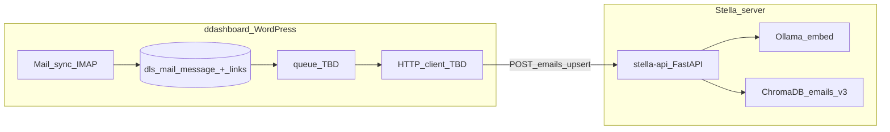

# ddashboard and Stella server — how they fit together

This document describes the **roles**, **network paths**, **data flows**, and **operational boundaries** between the **ddashboard** WordPress theme (Hetzner managed hosting) and the **Stella** stack (Hetzner dedicated server: FastAPI, Ollama, ChromaDB, Caddy, optional **IMAP mailbox copy** service).

**Related docs**

- Server topology and ports: [`../stella-server/infrastructure.md`](../stella-server/infrastructure.md)
- Stella HTTP API (FastAPI, **mail v3** indexing): [`../stella-server/stella-api.md`](../stella-server/stella-api.md)
- Stella **imapsync** helper (Express on `:3001`): [`../stella-server/imap-sync-service.md`](../stella-server/imap-sync-service.md)
- Email indexing end-to-end: [`email-indexing.md`](email-indexing.md)
- WordPress theme architecture (long): [`../stella-dashboard/architecture.md`](../stella-dashboard/architecture.md)

---

## 1. Roles

| System | Role |
|--------|------|
| **ddashboard** | Custom WordPress theme: CRM, accounting, IMAP mail in MySQL (**v3** tables `dls_mail_*`), REST `dls/v1`, React SPA, Anthropic AI chat and Ollama mail analyses. **Source of truth** for message rows, links, clients, and WP options. |
| **Stella** | Dedicated AI host: **Ollama** (LLM + embeddings), **ChromaDB** (v2 API), **stella-api** (FastAPI) — **`/emails/*`** targets collection **`emails_v3`** for vector search, **Caddy** on `:8080`. Optional **`imap-sync`**: Express + **`imapsync`** to copy mail between two IMAP accounts (**not** ddashboard’s DB import). |

Neither system replaces the other: WordPress owns relational data and sessions; Stella owns **vector search** and heavy models next to Ollama/Chroma.

---

## 2. Network and trust model

- **Browser** talks only to **WordPress** (HTTPS). The browser **does not** call Stella for product features.
- **WordPress (ddashboard)** makes **server-to-server** HTTP to Stella when indexing or tests are configured:
  - **Email indexing:** `POST {base}/emails/upsert`, `DELETE {base}/emails/message/{message_id}`, `POST {base}/emails/query`, optional `GET …/emails/document/msg_*` / `GET …/emails/message/{id}` for debugging.
  - **Health / tests:** `inc/routes/stella-api-test.php` (when present), e.g. `GET {base}/chat/health`.
- **Base URL** — WordPress option **`dls_stella_email_index_url`**: full HTTP root including path prefix, **no** trailing slash in stored value (clients typically `rtrim` before concat). Example with Caddy: `http://<stella-host>:8080/stella` → `…/stella/emails/upsert`.
- **Auth:** Stella’s **mail index API has no HTTP auth**; restrict ingress (UFW / known egress IP / VPN — see infrastructure doc). Optional **`dls_stella_email_index_key`** may be sent as **`X-Stella-Key`** from WordPress for forward compatibility; current Stella deploy does not require it.
- **Embed toggles** — historical options such as `dls_email_embed_enabled` / batch size may apply once the **v3** queue client is reintroduced; see [`email-indexing.md`](email-indexing.md).

---

## 3. Data flow — email indexing (mail v3)

```mermaid
flowchart LR
  subgraph wp [ddashboard_WordPress]
    IMAP[Mail_sync_IMAP]
    DB[(dls_mail_message_+_links)]
    Q[queue_TBD]
    CLIENT[HTTP_client_TBD]
  end
  subgraph stella [Stella_server]
    API[stella-api_FastAPI]
    OLL[Ollama_embed]
    CHR[ChromaDB_emails_v3]
  end
  IMAP --> DB
  DB --> Q
  Q --> CLIENT
  CLIENT -->|POST_emails_upsert| API
  API --> OLL
  API --> CHR
```

1. IMAP sync persists rows in **`dls_mail_message`** and **`dls_mail_message_link`** (see theme mail docs).
2. **[Planned]** When indexing is enabled, a queue or scheduler drains pending messages and calls **`POST /emails/upsert`** with the payload described in [`stella-api.md`](../stella-server/stella-api.md).
3. Stella embeds once per message and upserts **one Chroma document per link** (or a sentinel if there are no links).
4. **[Planned]** On **`dls_mail_message` delete**, WordPress calls **`DELETE /emails/message/{message_id}`** so vectors do not linger.

**Detail:** [`email-indexing.md`](email-indexing.md).

---

## 4. AI features — who calls whom

| Feature | Where it runs | Typical backend |
|---------|----------------|-----------------|
| **AI chat (“Stella” / agents)** | Browser → WordPress `dls/v1/ai/chat` | **Anthropic** (`AnthropicChatService`) |
| **E-Mail-AI-Analysen** (writing style, classification) | WordPress async jobs / cron | **Ollama** on configured host; corpus from mail tables |
| **Vector search / RAG over mail** | WordPress → Stella | **`POST /emails/query`** on stella-api; metadata `where` filters |
| **Email embedding / index** | WordPress → Stella | **`POST /emails/upsert`** into **`emails_v3`** |

---

## 4a. Stella `imap-sync` (mailbox copy)

- **Purpose:** Operator **server-to-server IMAP copy** (`imapsync`), HTTP API for jobs/logs — not ddashboard’s MySQL mail import.
- **WordPress:** Werkzeuge → E-Mail-Migration proxies **`/dls/v1/imap-sync/*`** to Stella (`inc/routes/imap-sync-proxy.php`).
- **Contract:** [`../stella-server/imap-sync-service.md`](../stella-server/imap-sync-service.md).

---

## 5. REST touchpoints (ddashboard)

| Area | Notes |
|------|--------|
| Mail CRUD / sync | `inc/routes/mail-*.php`, `MailSyncV2`, `MailDbService` — **source rows** for upsert payloads |
| Stella health / query tests | `inc/routes/stella-api-test.php` (update paths for **`emails_v3`** / normalized query body when wiring) |
| Options | `inc/services/option-service.php` — `dls_stella_email_index_url`, `dls_stella_email_index_key`, embed-related options |

Paths use WordPress REST prefix `/wp-json/dls/v1/…`.

---

## 6. Security checklist

1. **Revoke** any PAT accidentally committed; use SSH for private clones.
2. **Do not** expose Ollama/Chroma/stella-api `:8001` publicly without controls; prefer Caddy + UFW.
3. **Rotate** `dls_stella_email_index_key` if ever used as a shared secret; network restriction remains primary.
4. **HTML mail** stays sandboxed in the browser; only **plain / sanitised** text should be sent in the `document` field for embeddings.

---

## 7. Ops — submodule and documentation

- Canonical docs live in **`stella-docs`** (this tree), submodule from the theme: **`docs/stella-docs`**.
- When behaviour changes, update **`stella-dashboard/`**, **`stella-server/`**, and **`integration/`** together where applicable.

**Logs (Stella):** e.g. `docker logs services-stella-api-1 --tail 50` (container name may vary — see [`../stella-server/infrastructure.md`](../stella-server/infrastructure.md)).

---

## 8. Glossary

| Term | Meaning |
|------|---------|
| **ddashboard** | WordPress theme / product |
| **Stella** | Dedicated server hosting AI services |
| **stella-api** | FastAPI app — **`/chat/*`**, **`/emails/*`** ( **`emails_v3`** collection ) |
| **imap-sync** | Express on Stella `:3001`; **`imapsync`** mailbox migration |
| **gitlink** | Git submodule pointer SHA for `stella-docs` |
